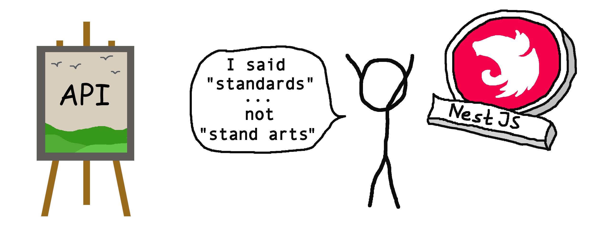

<p align="center">
  <br>
  <br>
  
  <br>
  <br>
  It's the NestJS superset of
  <a href="https://github.com/tectonique/api-standards">tectonique/api-standards 🔗</a>
  including ready to use data validation mechanism etc.
  <br>
  <br>
</p>

# 🌩 API Standards – NestJS
This library is based on [tectonique/api-standards 🔗](https://github.com/tectonique/api-standards).

It implements its Envelope and ProblemDetail schema for NestJS applications.

Additionally, this library provides low barrier validation mechanisms powered by [Zod 🔗](https://github.com/colinhacks/zod). 

# 📖 Table of contents

<!-- TOC -->
* [🌩 API Standards – NestJS](#-api-standards--nestjs)
* [📖 Table of contents](#-table-of-contents)
* [📦 NPM Package](#-npm-package)
* [💾 Installation](#-installation)
* [🏁 Goal](#-goal)
* [📑 Documentation](#-documentation)
  * [📨 Envelopes and ⚠️ Problem Details](#-envelopes-and--problem-details)
  * [💎 Zod powered data validation and transformation](#-zod-powered-data-validation-and-transformation)
* [📜 Changelog](#-changelog)
* [🦔 Author](#-author)
<!-- TOC -->

# [📦 NPM Package](https://www.npmjs.com/package/@tectonique/api-standards-nestjs)

# 💾 Installation

Using npm:
```bash
npm i @tectonique/api-standards-nestjs
```

Using yarn:
```
yarn add @tectonique/api-standards-nestjs
```

To install all components, do use `useApiStandards(app)`:

```typescript
import { useApiStandards } from '@tectonique/api-standards-nestjs';

async function bootstrap() {
    const app = await NestFactory.create(AppModule);

    // Register all NestJS API standards components.
    useApiStandards(app, () => {
        return InternalServerProblemDetail();
    });
    
    await app.listen(8080);
}

bootstrap();
```

# 🏁 Goal
The goal of the library is to help you create:
- NestJS APIs with validated incoming data (query params, request bodies)
- a scalable and type safe error handling system
- 100% type safe API calls

Check out the following examples:
- [Frontend: 100% type safe api calls thanks to envelopes](./src/Envelopes/README.md#-type-safe-api-calls)
- [Backend: Validated request bodies](./src/Validation/README.md#-validated-request-bodies)

# 📑 Documentation

## [📨 Envelopes and ⚠️ Problem Details](./src/Validation/README.md)

## [💎 Zod powered data validation and transformation](./src/Envelopes/README.md)

# [📜 Changelog](CHANGELOG.md)

# 🦔 Author
<p align="center">
  <b>Peter Kuhmann</b>
  <br>
  <a href="https://github.com/hedgehogs-mind">GitHub: hedgehogs-mind</a>
  <br>
  <br>
  <br>
  <b>Tectonique</b>
  <br>
  <br>
  
</p>